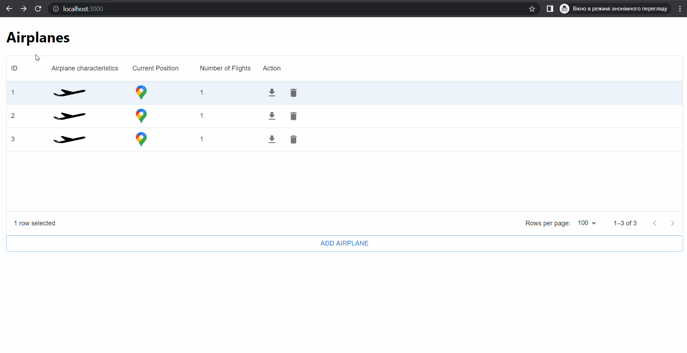
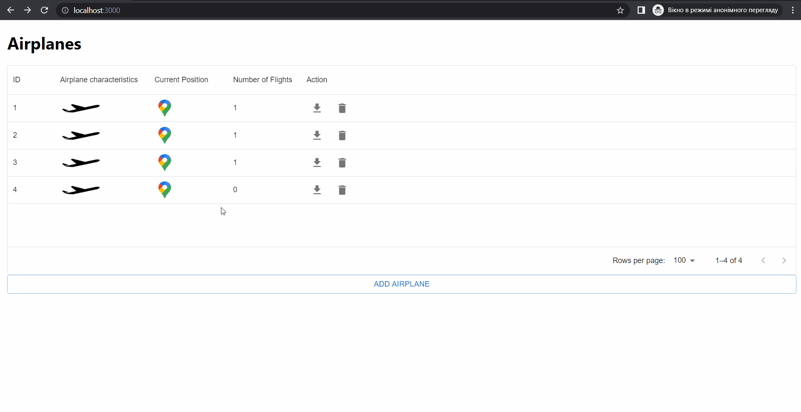

# FLight Calculator app
Web Application for calculating paths through point list in three-dimensional flat space and saving it as temporal point list using constants:
1. precision for saving temporal plane point through path = 1 second
2. airplane characteristics are individual for each plane and declaring in model class [AirplaneCharacteristics](src/main/java/com/goose/calculator/model/AirplaneCharacteristics.java)

##Stack
1. mongodb as database
2. spring boot as backend
3. react, mui and three.js as frontend

## Run 
0. open terminal
####
1. in app folder insert
    ```maven
    mvn clean install -DSkipTests
    ```
    or select maven installation in any IDE to your liking.
####
2. go to ```app/src/main/frontend``` and insert
    ```npm
    npm run build
    ```
   or build frontend package in any IDE directly.
####
3. go up to app folder
    ```docker
    docker-compose up
    ```

### Demo
1. open ```localhost:3000``` page in browser
    
There are some features like popup plane characteristics and position or adding/deleting/downloading functionality on this page.
####
2. double-click on plane row
    
There are the same features on this one and a new one: "Calculate Flight" which do calculations that needed for next page. 
####
3. double-click on a flight row
    
This page is for step by step flight`s schematic visualisation through waypoints. 
User have configs for detalization airplane characteristics through way.
